# Software Requirements Specification (SRS)

## 1. Yêu cầu chức năng

### 1.1 Biểu đồ Use Case

```mermaid
%%{init: {"flowchart": {"htmlLabels": true, "curve": "cardinal", "useMaxWidth": false}, "theme": "default", "themeVariables": {"fontSize": "16px"}} }%%
flowchart TB
    classDef patientClass fill:#d4f1f9,stroke:#05acfa,stroke-width:2px,color:#333,font-weight:bold
    classDef doctorClass fill:#d8f3dc,stroke:#40916c,stroke-width:2px,color:#333,font-weight:bold
    classDef receptionistClass fill:#ffe5d9,stroke:#f4a261,stroke-width:2px,color:#333,font-weight:bold
    classDef adminClass fill:#f8edeb,stroke:#e07a5f,stroke-width:2px,color:#333,font-weight:bold

    subgraph Actors
        direction LR
        subgraph Patient [" BỆNH NHÂN "]
            direction TB
            P1[/"Đăng ký/Đăng nhập"\]
            P2[/"Tìm kiếm bác sĩ"\]
            P3[/"Đặt lịch hẹn"\]
            P4[/"Xem lịch hẹn cá nhân"\]
            P5[/"Thanh toán"\]
            P6[/"Đánh giá dịch vụ"\]
            
            P1 --- P2
            P2 --- P3
            P3 --- P4
            P4 --- P5
            P5 --- P6
        end

        subgraph Doctor [" BÁC SĨ "]
            direction TB
            D1[/"Quản lý lịch làm việc"\]
            D2[/"Xem danh sách bệnh nhân"\]
            D3[/"Xem hồ sơ bệnh nhân"\]
            D4[/"Cập nhật thông tin cá nhân"\]
            
            D1 --- D2
            D2 --- D3
            D3 --- D4
        end

        subgraph Receptionist [" LỄ TÂN "]
            direction TB
            R1[/"Xác nhận lịch hẹn"\]
            R2[/"Quản lý phòng khám"\]
            R3[/"Hỗ trợ bệnh nhân"\]
            
            R1 --- R2
            R2 --- R3
        end

        subgraph Admin [" QUẢN TRỊ VIÊN "]
            direction TB
            A1[/"Quản lý người dùng"\]
            A2[/"Quản lý dịch vụ"\]
            A3[/"Xem báo cáo thống kê"\]
            A4[/"Quản lý nội dung"\]
            
            A1 --- A2
            A2 --- A3
            A3 --- A4
        end
    end

    class Patient,P1,P2,P3,P4,P5,P6 patientClass
    class Doctor,D1,D2,D3,D4 doctorClass
    class Receptionist,R1,R2,R3 receptionistClass
    class Admin,A1,A2,A3,A4 adminClass
```

### 1.2 Các yêu cầu chi tiết

1. **Quản lý người dùng**
   - Đăng ký, đăng nhập, đăng xuất
   - Phân quyền người dùng (Admin, Bác sĩ, Bệnh nhân, Lễ tân)
   - Quản lý thông tin cá nhân, đổi mật khẩu

2. **Quản lý lịch hẹn**
   - Tìm kiếm và chọn bác sĩ theo chuyên khoa
   - Xem lịch rảnh của bác sĩ và đặt lịch hẹn
   - Xem, hủy hoặc thay đổi lịch hẹn
   - Nhận thông báo nhắc lịch hẹn

3. **Quản lý dịch vụ y tế**
   - Xem danh sách dịch vụ, giá cả và mô tả
   - Xem thông tin chuyên khoa và bác sĩ
   - Đánh giá và phản hồi về dịch vụ

4. **Quản lý thanh toán**
   - Thanh toán dịch vụ trực tuyến
   - Xem lịch sử thanh toán
   - Xuất hóa đơn

5. **Hồ sơ y tế**
   - Lưu trữ thông tin y tế của bệnh nhân
   - Xem lịch sử khám bệnh

6. **Thống kê và báo cáo**
   - Thống kê số lượng bệnh nhân, lịch hẹn
   - Báo cáo doanh thu

## 2. Yêu cầu phi chức năng

### 2.1 Bảo mật
- Xác thực và ủy quyền người dùng bằng JWT
- Mã hóa dữ liệu nhạy cảm
- Bảo vệ thông tin y tế của bệnh nhân

### 2.2 Hiệu năng
- Thời gian phản hồi nhanh (<2 giây)
- Hỗ trợ nhiều người dùng đồng thời
- Khả năng mở rộng khi tăng lượng người dùng

### 2.3 Khả năng sử dụng
- Giao diện người dùng thân thiện, dễ sử dụng
- Hỗ trợ đa ngôn ngữ
- Thiết kế đáp ứng trên nhiều thiết bị

### 2.4 Độ tin cậy
- Hệ thống hoạt động 24/7
- Sao lưu dữ liệu định kỳ
- Khả năng phục hồi sau sự cố 